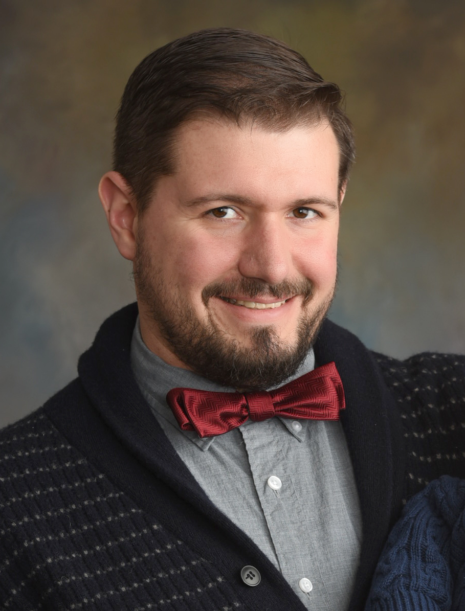

## Welcome to my portfolio

I am an experienced Decision Scientist with a demonstrated history of working with large datasets. I'm skilled in Project Management, Data Analytics, Quantitative Analysis, Public Speaking, and Programming Languages including SQL, Python, & R. I possess a Master of Science (M.S.) Business Intelligence and Analytics from Rockhurst University and currently working towards a Master of Science (M.S.) Computer Science with a focus on Data Science and Engineering from the University of Kansas School of Electrical Engineering and Computer Science.

 

### Current Role:
I joined Disney in 2021 as a Lead Decision Science Engineer where I currently work on the People Insights & Analytics team as a part of The Walt Disney Company. My responsibilities in this role include the following:

- Lead a team of Decision Scientists in developing scalable machine learning models and data pipelines
- Collaborate with various business partners to identify needs and design analytic solutions that enhance their operations, including involvement in use case discovery and solution development
- Develop, optimize, and validate models with Python, ensuring alignment of technical standards and business requirements
- Analyze, design/architect, build, and maintain machine learning models, data pipelines and automated insights
- Ensure our models are developed with Data Governance, Data Privacy, and Bias Mitigation measures to uphold ethical standards, foster transparency, and promote fair and responsible use
- Develop Python, R, SQL, & pipeline workflow technologies to create automated processes for model & project management
- Build and work with large and complex data sets and measures to develop analytics that drive business decisions
- Proactively identify opportunities and build solutions for optimization of Machine Learning and Analytics models
- Research and hypothesize new advanced statistical models as a subject matter expert and through continuing education
- Manage and sustain an analytical infrastructure, technologies and solutions across a team of decision science partners
- Research emerging Gen AI tools and their underlying functionality to provide context to feasibility for business applications and understanding how integration may be applicable
- Proactively identify emerging trends in Machine Learning and data engineering to enhance and develop solutions
- Develop web applications for interaction with and analysis of model outputs with data collection and update capabilities 

### Previous Roles:
Before joining Disney, I worked at Sprint & T-Mobile as a Data Scientist, and I obtained my Certified Public Account (CPA) license and Certified Fraud Examiner (CFE) designation before entering the field of data science. I served as a local user group leader for an audit industry specific analytics tool, as well as the Technology Director for the Kansas City Association of Certified Fraud Examiners. In my spare time, I spend time with my family, experiment with Machine Learning models, and research Sabermetrics (the application of statistical analysis to baseball data).

